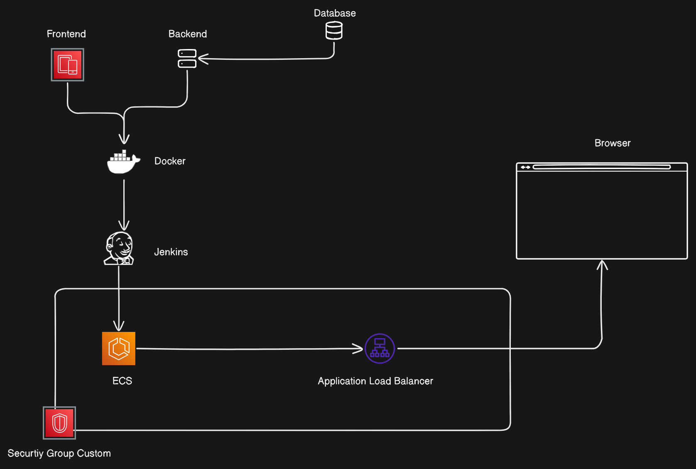

# Application Architecture README

## Overview

This document outlines the architecture and flow of our Coffee Shop Application, from the frontend interactions to the backend processes and deployment pipeline. The application leverages modern technologies such as React, Node.js, MongoDB, Docker, Jenkins, and AWS ECS to provide a robust and scalable solution.

    

## Application Components

1. **Frontend (React)**
   - The user interacts with the React application in their browser.
   - The React application sends HTTP/HTTPS requests to the backend.

2. **Backend (Node.js with Express)**
   - Receives requests from the React frontend.
   - Processes requests and interacts with the MongoDB database.
   - Sends responses back to the React frontend.

3. **Database (MongoDB)**
   - The Node.js backend interacts with MongoDB for CRUD operations.

4. **Docker**
   - Frontend and backend applications are containerized.

5. **Jenkins**
   - Jenkins pulls code from version control.
   - Builds Docker images for frontend and backend.
   - Runs automated tests.
   - Pushes Docker images to a container registry.

6. **Amazon ECS (Elastic Container Service)**
   - Jenkins triggers deployment to ECS.
   - ECS runs and manages Docker containers.

7. **Application Load Balancer**
   - Distributes incoming traffic across ECS instances.

8. **Security Group Custom**
   - Controls inbound and outbound traffic to ECS instances.

## Overall Flow

1. **User** -> **React Frontend (browser)**
2. **React Frontend** -> **Node.js Backend**
3. **Node.js Backend** -> **MongoDB Database**
4. **MongoDB Database** -> **Node.js Backend**
5. **Node.js Backend** -> **React Frontend**
6. **Docker** containerizes applications
7. **Jenkins** automates CI/CD
8. **ECS** manages Docker containers
9. **Load Balancer** distributes traffic
10. **Security Groups** secure communication

## Detailed Flow Description

1. **User Interaction**
   - The user interacts with the application through the React frontend in their web browser.

2. **Frontend Requests**
   - The React frontend sends HTTP/HTTPS requests to the Node.js backend for data retrieval or submission.

3. **Backend Processing**
   - The Node.js backend receives requests from the frontend, processes them, and interacts with the MongoDB database as needed.

4. **Database Operations**
   - The MongoDB database handles CRUD operations (Create, Read, Update, Delete) requested by the Node.js backend.

5. **Response Handling**
   - The Node.js backend sends the processed data or responses back to the React frontend.

6. **Containerization with Docker**
   - Both the frontend and backend applications are containerized using Docker, ensuring consistent and portable deployment environments.

7. **Continuous Integration/Continuous Deployment (CI/CD) with Jenkins**
   - Jenkins pulls the latest code from the version control system, builds Docker images for the frontend and backend, runs automated tests, and pushes the Docker images to a container registry.

8. **Deployment with Amazon ECS**
   - Jenkins triggers the deployment of the Docker images to Amazon ECS, which manages and runs the Docker containers.

9. **Traffic Management with Application Load Balancer**
   - The Application Load Balancer distributes incoming traffic across the ECS instances to ensure high availability and reliability.

10. **Security with Custom Security Groups**
   - Custom Security Groups control inbound and outbound traffic to and from the ECS instances, ensuring secure communication within the architecture.
