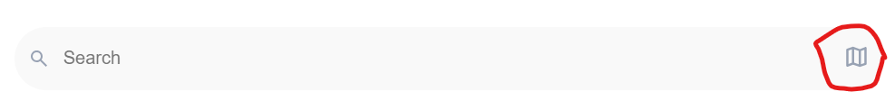

# Application Flow README

## Overview

This document outlines the application flow for our Coffee Shop Application. It details the process from login/signup to exploring coffee shops, adding products to the cart and favorites, and navigating through various features. Additionally, it mentions some features that could be implemented with more time.

## Application Flow

0. **Login/Signup**
    - Users can log in or sign up to access the application.
    -  For testing purposes, use the following credentials:
      - **Email:** test@gmail.com
      - **Password:** test@123
    - **The application is designed to be responsive and works on a variety of screen sizes, including MacBook and all mobile devices.**
    - Desktop:
      <div align="center">
          
      </div>
    - Mobile:
      <div align="center">
          
      </div>
    - Register:
      - Desktop:
        <div align="center">
            
        </div>
      - Mobile:
        <div align="center">
            
        </div>
1. **Explore Coffee Shops**
    - Users can explore different coffee shops available in the application.
    - The first two coffee shops have detailed data including their menu.
      - **Coffee Shop 1:**
        - Name: Blue Tokai Coffee Roasters | Koramangala
      - **Coffee Shop 2:**
        - Name: Third Wave Coffee
2. **Dashboard**
    - After logging in, users are directed to the dashboard.
    - The dashboard provides a basic search feature with a map to locate nearby coffee shops.
    - Desktop:
      <div align="center">
          
      </div>
    - Mobile:
      <div align="center">
          
      </div>

3. **Map Navigation**
    - Users can navigate to the map from the search bar.
    - Desktop:
      <div align="center">
          
      </div>
    - Mobile:
      <div align="center">
          
      </div>

4. **Map Page**
    - Shows the location of the coffee shops.
    - Desktop:
      <div align="center">
          
      </div>
    - Mobile:
      <div align="center">
          
      </div>

5. **Coffee Shop Cards**
    - Coffee shops are displayed in card format.
    - Users can click on any shop to view its products.
    - Desktop:
      <div align="center">
          
      </div>
    - Mobile:
      <div align="center">
          
      </div>

6. **Product Categories**
    - Each shop offers products categorized into:
        - Coffee
        - Food
        - Drinks

7. **Add to Cart and Favorites**
    - Users can add products to their cart.
    - Users can also mark products as favorites.

8. **Cart Page**
    - Users can view and manage items in their cart.
    - An order number is associated with each order in the cart.
    - Desktop:
      <div align="center">
          
      </div>
    - Mobile:
      <div align="center">
          
      </div>

9. **Favorites Page**
    - Users can view their favorite products.
    - Desktop:
      <div align="center">
          
      </div>
    - Mobile:
      <div align="center">
          
      </div>

10. **Menu**
    - Users can view the menu.
    - Desktop:
      <div align="center">
          
      </div>
    - Mobile:
      <div align="center">
          
      </div>

## Features to be Implemented

Due to time constraints, the following features are planned but not yet implemented:

1. **Order Number Increment**
    - Automatically increase the order number for each order in the cart page.

2. **Advanced Filter**
    - Filter coffee shops based on distance from the user's location.
    - Search products based on the menu.

3. **Razorpay Integration**
    - Integrate Razorpay portal for checkout using test keys.

4. **Responsive Design**
    - Ensure the application is compatible with all screen sizes.

## Reason for Time Constraints

The primary reason for not implementing the above features within the current timeframe is the complexity and breadth of the tech stack used. The application is being developed using React, Node.js, and MongoDB. Each of these technologies requires careful consideration and implementation:

- **React**: Building a dynamic, responsive frontend requires a significant amount of time to ensure smooth user interactions, state management, and component lifecycle management.
    
- **Node.js**: Setting up a robust backend to handle user authentication, data management, and API integrations is essential for the application's performance and security.
    
- **MongoDB**: Structuring the database to efficiently store and retrieve user data, coffee shop information, and product details involves meticulous planning and execution.

Balancing the development of core functionalities while ensuring the application remains scalable, maintainable, and secure has been a priority. As such, some features have been deferred to a later stage to maintain high quality and stability in the initial release.

## Application Flow Diagram
```
+-----------------+           +-----------+           +----------------+
|  Login/Signup   |  ----->   | Dashboard |  ----->   | Coffee Shop    |
+-----------------+           +-----------+           +----------------+
                                                            |
                                                            v
                                                    +------------------+
                                                    | Product Categories|
                                                    +------------------+
                                                            |
                                                            v
                                            +---------------------------+
                                            | Add to Cart / Favorites   |
                                            +---------------------------+
                                                            |
                                                            v
                                        +--------------+                  +----------------+
                                        |  Cart Page   |                  | Favorites Page |
                                        +--------------+                  +----------------+
                                                            |
                                                            v
                                                        +-------------+
                                                        | Profile Page|
                                                        +-------------+
                                                            |
                                                            v
                                                        +--------------+
                                                        | Logout (Mobile)|
                                                        +--------------+
```

1. **Login/Signup**: User authentication process.
2. **Dashboard**: Displays a search feature and map.
3. **Coffee Shops**: Lists coffee shops in card format.
4. **Product Categories**: Displays products in categories: Coffee, Food, Drinks.
5. **Add to Cart/Favorites**: Allows users to add products to cart or mark as favorites.
6. **Cart Page**: Users can view and manage their cart.
7. **Favorites Page**: Users can view their favorite products.

### Notes:
- **Order Number Increment**: Planned for the cart page.
- **Advanced Filter**: Planned for search and filter features.
- **Razorpay Integration**: Planned for the checkout process.
- **Responsive Design**: Planned for all screen sizes.
